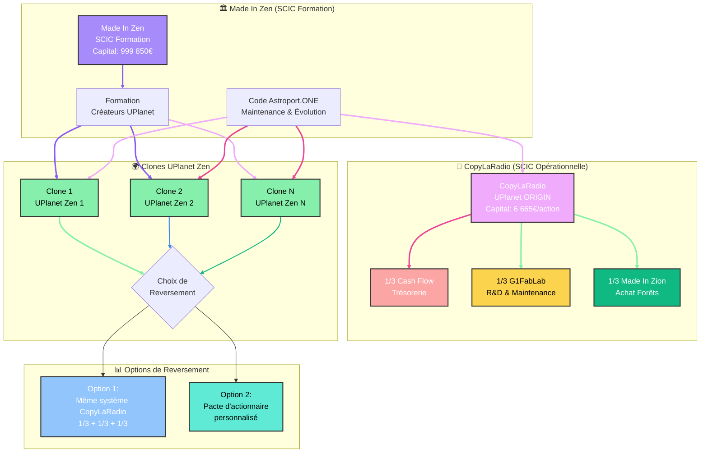

# UPlanet: Guide d'Entrée et d'Utilisation

## 🏠 Pourquoi UPlanet ? L'Analogie de l'Immobilier Numérique

### 🌍 Bienvenue dans UPlanet

UPlanet est un système décentralisé qui transforme Internet en un réseau géographique basé sur la confiance, utilisant IPFS, NOSTR et des clés géosphériques pour créer un écosystème numérique résilient et libre. Développé par la SCIC CopyLaRadio, UPlanet propose une économie transparente pour un Internet qui vous appartient vraiment.

### 🏨 L'Analogie de l'Immobilier Numérique

Imaginez Internet comme une ville numérique où vous avez trois options pour "habiter" :

#### 🏨 **Les GAFAM = L'Hôtel**
- **Vous êtes un client** : Vous payez pour utiliser leurs services
- **Vous ne possédez rien** : Vos données, votre identité, votre contenu leur appartiennent
- **Vous dépendez d'eux** : Ils peuvent vous expulser, modifier les règles, augmenter les prix
- **Pas de liberté** : Vous devez suivre leurs conditions d'utilisation
- **Surveillance constante** : Vos activités sont tracées et monétisées

#### 🏠 **UPlanet = Chez Vous ou Chez un Ami**
- **Vous êtes propriétaire** : Votre identité numérique, vos données, votre contenu vous appartiennent
- **Vous contrôlez tout** : Personne ne peut vous expulser ou modifier vos règles
- **Vous êtes libre** : Vous choisissez comment utiliser vos espaces numériques
- **Confiance et transparence** : Tout est ouvert et vérifiable
- **Économie participative** : Vous gagnez en créant de la valeur

### 🎯 **Pourquoi Choisir UPlanet ?**

#### **1. Propriété Numérique Réelle**
- **Votre identité** : Clés cryptographiques uniques et sécurisées
- **Vos données** : Stockage décentralisé IPFS sous votre contrôle
- **Votre contenu** : Créations protégées et monétisables
- **Votre réseau** : Connexions authentiques basées sur la confiance

#### **2. Liberté et Autonomie**
- **Pas de censure** : Contenu résistant aux blocages
- **Pas de surveillance** : Communications privées et sécurisées
- **Pas de dépendance** : Infrastructure décentralisée et résiliente
- **Pas de publicité** : Écosystème sans exploitation publicitaire

#### **3. Économie Équitable**
- **Revenus passifs** : +1 Ẑen par like sur votre contenu
- **Transparence totale** : Tous les flux financiers sont publics
- **Participation aux bénéfices** : Dividendes pour les sociétaires
- **Pas de frais cachés** : Tarification claire et équitable

## 🚀 Comment Commencer ?

### Étape 1 : Comprendre l'Écosystème
- **Lisez cette documentation** pour comprendre les services
- **Explorez la carte** UPlanet pour voir les communautés actives
- **Identifiez un Captain** proche de chez vous sur la carte

### Étape 2 : Contacter un Captain
- **Les Captains** sont vos "agents immobiliers" numériques
- **Ils vous accompagnent** dans votre installation et formation
- **Ils gèrent** l'infrastructure technique locale
- **Ils vous forment** aux outils et à l'écosystème

### Étape 3 : Libérer votre Avatar Numérique
- **Création d'identité** : Génération de vos clés cryptographiques
- **Installation des services** : MULTIPASS ou ZENCARD selon vos besoins
- **Formation personnalisée** : Apprentissage des outils et bonnes pratiques
- **Intégration communautaire** : Connexion avec les autres utilisateurs

## 🛠️ Avec Quoi ? Les Outils de Votre Écosystème

### MULTIPASS (1 Ẑen/semaine) - Votre "Studio Numérique"
- **Identité sécurisée** : Carte MULTIPASS personnelle
- **Assistant IA personnel** (demo) : #BRO pour toutes vos questions
- **Réseau social libre** : NOSTR sans censure
- **Revenus passifs** : Recevez des Ẑen quand on aime vos publications

### ZENCARD (4 Ẑen/semaine) - Votre "Appartement Numérique"
- **Cloud privé** : NextCloud 128 GB décentralisé
- **Assistant IA personnel** : #12 mémoires pour vous assister dans vos réponses
- **Dé-googlisation** : Remplace tous les services GAFAM
- **Stockage résistant** : IPFS distribué et sécurisé
- **Tous les avantages MULTIPASS** inclus

### Sociétaire CopyLaRadio - Votre "Maison Numérique"
- **Propriété partielle** : Actionnaire de la SCIC
- **Gouvernance** : Participation aux décisions stratégiques
- **Revenus actifs** : Commissions et dividendes
- **Formation complète** et support prioritaire

## 🎯 L'Impact de Votre Choix

### Pour Vous
- **Souveraineté numérique** : Contrôle total de votre vie en ligne
- **Revenus supplémentaires** : Monétisation Ẑen de vos créations
- **Communauté authentique** : Connexions basées sur la confiance
- **Apprentissage continu** : Développement de compétences numériques

### Pour la Société
- **Internet libre** : Alternative aux monopoles numériques
- **Économie locale** : Développement de communautés résilientes
- **Innovation ouverte** : Technologies libres et accessibles
- **Démocratie numérique** : Gouvernance participative et transparente

### 📞 Prochaines Étapes Immédiates

1. **Explorez la carte** : https://qo-op.com
2. **Créez un MULTIPASS** le Captain le plus proche vous contactera pour un accompagnement personnalisé

---

*UPlanet : De l'hôtel numérique à la propriété numérique. Choisissez la liberté, la transparence et la souveraineté. Votre avenir numérique vous appartient.*

## 🚀 Comment Accéder à UPlanet

### Accès Principal
- **UPlanet ORIGIN :** https://ipfs.copylaradio.com/ipns/copylaradio.com
- Les sociétaires seront installés sur **UPlanet Zen [0] :** https://ipfs.g1sms.fr/ipns/copylaradio.com

### Interface de Carte Interactive
L'interface principale d'UPlanet présente une carte du monde divisée en grilles géographiques :

1. **Grille Principale :** 36 x 18 cellules (10° de précision)
2. **Navigation :** Cliquez sur une cellule pour zoomer vers des sous-grilles plus précises
3. **Niveaux de Zoom :**
   - **ZONE :** 10° de précision
   - **REGION :** 1.0° de précision
   - **SECTOR :** 0.1° de précision
   - **UMAP :** 0.01° de précision

## 🎯 Fonctionnalités Principales

### 1. Carte Interactive avec Données en Temps Réel

#### Affichage des DRAGONS (API :1234 - localhost)
- **Marqueurs bleus** indiquent les stations Astroport.ONE actives
- **Compteurs** sur chaque grille montrent le nombre de DRAGONS (utilisateurs) dans la zone
- **Texte défilant** en haut affiche les informations des DRAGONS en rotation
- **Liens ♥️BOX** pour accéder aux contenus IPFS via IPNS

#### Affichage des UMAPs et PLAYERS (API :54321)
- **Icônes PLAYER** (🧑‍💼) : Utilisateurs NOSTR avec ZENCARD
- **Icônes UMAP** (🧩) : Zones géographiques avec contenu IPFS
- **Popups informatifs** avec liens vers :
  - Profils NOSTR
  - Drives IPFS
  - Informations de localisation

### 2. Basculement Vue Carte/Satellite
- **Bouton 🛰️** : Bascule vers la vue satellite
- **Bouton 🗺️** : Retour à la vue carte
- **Préférence sauvegardée** dans le navigateur

### 3. Résumé UPlanet
Panneau d'information affichant les statistiques :
- **🗺️ Régions** : Nombre de régions actives
- **🗂️ Secteurs** : Nombre de secteurs actifs  
- **🧩 UMAPs** : Zones géographiques avec contenu
- **🧑‍💼 Sociétaires (ZENCARD)** : Utilisateurs avec cartes ZenCard
- **👤 Utilisateurs (MULTIPASS)** : Utilisateurs NOSTR de base

## 🔗 Navigation et Interactions

### Cliquer sur une Grille
- **Grille 10°** → Zoom vers grilles 1°, 0.1°, 0.01°
- **Grille 0.01°** → Affichage du bandeau d'inscription MULTIPASS (UMAP)
- **Vues** "carte routière" ou "satellite"

### Liens dans les Popups
- **NOSTR** : Accès aux profils NOSTR des utilisateurs (MULTIPASS)
- **IPFS Drive** : Accès aux drives IPFS uMARKET des UMAPs
- **♥️BOX** : Accès aux contenus IPFS via IPNS (activable sur UPlanet Zen uniquement avec l'option vanguard)

### Barre de Navigation
- **💬** : UPlanet Geo Message
- **🛂** : MULTIPASS Scanner
- **⌂ ?** : Géolocalisation automatique
- **VISIO ROOM** : Salle de visioconférence vdo.ninja

## 🛠️ Intégration avec Astroport.ONE

### API Automatique
UPlanet se connecte automatiquement aux APIs Astroport.ONE :

```javascript
// Conversion automatique des URLs
ipfs.copylaradio.com → astroport.copylaradio.com/12345 (DRAGONS API :12345)
ipfs.copylaradio.com → u.copylaradio.com (UPLANET API :54321)
```

### Services Disponibles
- **Port 12345** : API DRAGONS (données des stations)
- **Port 54321** : API UPassport (données utilisateurs et UMAPs)
- **Port 8080** : Gateway IPFS
- **Port 7777** : Gateway NOSTR

## 💰 Modèle Économique Transparent

### La Monnaie Libre Ğ1 et le Ẑen
UPlanet utilise la Monnaie Libre Ğ1 et son "stablecoin" multivaleur Ẑen comme base économique :

- **Ẑen (Ẑ)** : Stablecoin type "0.1" de la Monnaie Libre Ğ1
- **Transparence totale** : Tous les flux financiers sont publics
- **Pas de profit caché** : Économie basée sur la confiance et la coopération
- **Dividende Universel** : Dividende Universel (DU) pour tous les "citoyens"

### Économie Circulaire et Micro-paiements
UPlanet implémente un système économique unique où chaque interaction sociale génère de la valeur :

- **+1 Ẑen par like** : Chaque réaction positive sur le contenu génère automatiquement 0.1 Ğ1 (équivalent à 1 Ẑen) pour son créateur
- **Paiements automatiques** : Les micro-paiements sont traités instantanément via le relais NOSTR / Ğ1
- **Économie participative** : Les utilisateurs récompensent directement la qualité du contenu
- **Transparence blockchain** : Tous les paiements sont visibles sur la blockchain Ğ1

### Services et Tarification

#### 1. 🌐 MULTIPASS (1 Ẑen/semaine)
- **Identité numérique** et assistant IA personnel
- **Réseau social NOSTR** décentralisé
- **Carte NOSTR** sécurisée
- **Assistant IA** (#BRO) pour interactions
- **Accès** à tous les services de base UPlanet

#### 2. ☁️ ZENCARD (4 Ẑen/semaine)
- **Cloud privé** NextCloud 128 GB
- **Dé-googlisation** du smartphone
- **Tous les avantages MULTIPASS**
- **Stockage** décentralisé IPFS
- **Synchronisation** multi-appareils

#### 3. ♥️BOX ⚡ CAPTAIN (Formation + Revenus)
- **Nœud de valeur** dans le réseau
- **Coopérative CopyLaRadio**
- **Revenus** en proposant MULTIPASS et ZENCARD
- **Formation complète** et support
- **Participation** à la gouvernance

### Transparence Financière
- **G1FabLab OpenCollective** : https://opencollective.com/monnaie-libre
- **Tous les comptes** publics et vérifiables
- **Pas de frais cachés** ou de commissions
- **Redistribution** équitable des bénéfices

## 🏠 Services et Avantages : Locataire vs Sociétaire

### 🌐 Locataire UPlanet (Utilisateur Standard)

#### Services Inclus
- **MULTIPASS** : Identité numérique et assistant IA personnel
- **Réseau social NOSTR** décentralisé avec relais privé
- **Carte Zine MULTIPASS** sécurisée et authentification
- **Assistant IA** (#BRO) pour interactions intelligentes
- **Accès** à tous les services de base UPlanet
- **Micro-paiements** : +1 Ẑen par like reçu sur votre contenu

#### Avantages Économiques
- **Revenus passifs** : Gagnez des Ẑen en créant du contenu de qualité
- **Pas de publicité** : Écosystème sans publicité intrusive
- **Contrôle total** : Vos données restent sous votre contrôle
- **Croissance communautaire** : Bénéficiez de l'expansion du réseau

#### Coût
- **1 Ẑen par semaine** (soit 1€/semaine sur UPlanet ẐEN)
- **Paiement flexible** : En Ẑen (1/3 convertible en € ou non)
- **Pas d'engagement** : Arrêtez quand vous voulez

### ☁️ Locataire ZENCARD (Utilisateur Premium)

#### Services Inclus
- **Tous les avantages MULTIPASS**
- **Cloud privé NextCloud** 128 GB décentralisé
- **Dé-googlisation** complète du smartphone
- **Stockage IPFS** sécurisé et résistant à la censure
- **Synchronisation** multi-appareils
- **Micro-paiements** : +1 Ẑen par like reçu

#### Avantages Économiques
- **Économies** : Remplace les services cloud payants (Google Drive, Dropbox, etc.)
- **Souveraineté numérique** : Contrôle total de vos données
- **Résilience** : Stockage distribué résistant aux pannes
- **Revenus passifs** : Gagnez des Ẑen en partageant du contenu

#### Coût
- **4 Ẑen par semaine** (UPlanet Ẑen = 4€/semaine)
- **Économies réalisées** : Plus que compensé par les services remplacés

### ⚡ Sociétaire CopyLaRadio (Actionnaire Coopératif)

#### Statut et Gouvernance
- **Actionnaire** de la SCIC CopyLaRadio
- **Participation** aux décisions stratégiques
- **Vote quadratique** pour les décisions importantes
- **Transparence totale** sur la gestion

#### Services Inclus
- **Tous les avantages ZENCARD**
- **Formation complète** UPlanet et Ğ1
- **Support prioritaire** et accompagnement
- **Accès** aux outils de développement
- **Participation** aux communautés locales
- **Micro-paiements** : +1 Ẑen par like reçu

#### Avantages Économiques

##### Revenus Directs
- **Commission** sur les MULTIPASS et ZENCARD vendus
- **Revenus passifs** : +1 Ẑen par like sur votre contenu
- **Dividendes** : Participation aux bénéfices de la SCIC
- **Conversion en Ẑen** : Possibilité de convertir jusqu'à 1/3 de vos parts par an

##### Avantages Financiers
- **Capital social** : 6 665 € par action (150 actions disponibles)
- **Gestion en Ẑen** : Parité fixée et révisable par le Conseil d'Administration
- **Croissance du capital** : Valorisation de votre investissement
- **Fiscalité avantageuse** : Statut SCIC

#### Avantages Sociaux et Environnementaux
- **Impact positif** : Contribution au développement d'un Internet libre
- **Communautés locales** : Participation aux Lieux autonomes "Astroport"
- **Formation** : Développement de compétences numériques
- **Réseau** : Intégration dans l'écosystème Ğ1 et UPlanet

#### Responsabilités et Engagement
- **Gouvernance participative** : Participation aux assemblées générales
- **Promotion** : Aide au développement de l'écosystème
- **Formation** : Accompagnement des nouveaux utilisateurs
- **Innovation** : Contribution aux développements technologiques

### 📊 Comparatif des Avantages

| Service | Locataire MULTIPASS | Locataire ZENCARD | Sociétaire CopyLaRadio |
|---------|-------------------|------------------|----------------------|
| **Coût hebdomadaire** | 1 Ẑen | 4 Ẑen | 6 665 € (capital) |
| **Identité numérique** | ✅ | ✅ | ✅ |
| **Assistant IA** | ✅ | ✅ | ✅ |
| **Cloud privé** | ❌ | ✅ | ✅ |
| **Micro-paiements** | ✅ | ✅ | ✅ |
| **Formation** | ❌ | ❌ | ✅ |
| **Support prioritaire** | ❌ | ❌ | ✅ |
| **Gouvernance** | ❌ | ❌ | ✅ |
| **Revenus** | Passifs uniquement | Passifs uniquement | Actifs + Passifs |
| **Impact** | Utilisateur | Utilisateur | Acteur du changement |

## 🔐 Authentification et Sécurité

### NOSTR Authentication (NIP-42)
- **Authentification** via événements NOSTR kind 22242
- **Relai local** : `ws://127.0.0.1:7777`
- **Validité** : 24 heures
- **Sécurité** : Clés privées stockées 2/3 côté serveur

### Twin-Key Mechanism
- **Clés jumelles** : NOSTR ↔ IPFS ↔ G1 ↔ Bitcoin ↔ Monero ...
- **Déterminisme** : Même graine pour toutes les clés
- **Propriété** : Contrôle total des données et identités

## 📱 Création de Compte UPlanet

### Sur l'applicaiton UPlanet de votre relai Astroport le plus proche, [consultez la carte sur "UPlanet ORIGIN"](https://ipfs.copylaradio.com/ipns/copylaradio.com) 

### Via API UPLANET
```http
GET /?uplanet=${EMAIL}&zlat=${LATITUDE}&zlon=${LONGITUDE}&g1pub=${LANGUAGE}
```

**Paramètres requis :**
- `uplanet` : Email de l'utilisateur
- `zlat` : Latitude (2 décimales)
- `zlon` : Longitude (2 décimales)  
- `g1pub` : Langue d'origine (optionnel)

### Processus Automatique
1. **Génération** des clés géosphériques
2. **Création** du drive IPFS personnel
3. **Enregistrement** dans la base de données UPlanet
4. **Intégration** dans le réseau de confiance Dragon

## 🌐 Architecture Décentralisée

### Réduction du "Bruit" Informationnel
UPlanet résout les problèmes du Web2 centralisé :

1. **IPFS** : Stockage distribué résistant à la censure
2. **NOSTR** : Diffusion ouverte sans filtrage algorithmique autre que N²
3. **Clés Géosphériques** : Identité et confiance décentralisées
4. **Applications Fédiverse** : Profitez de NextCloud (partager vos fichiers avec vos amis) et Peertube (diffuser vos créations sans censure). Chaque Capitaine assure que tous vos besoins logiciels sont couverts !!

### Qualité vs Quantité
- **Objectif** : Améliorer la qualité informationnelle
- **Méthode** : Réduire le bruit systémique
- **Résultat** : Information fiable et authentique

## 🎮 Utilisation Avancée

### Tags NOSTR Spéciaux
- `#BRO` (ou `#BOT`) : Interaction avec l'IA UPlanet
- `#search` : Recherche d'information
- `#image` : Génération d'images
- `#video` : Création de vidéos
- `#music` : Génération musicale
- `#youtube` : Téléchargement YouTube
- `#pierre` / `#amelie` : Synthèse vocale
- `#mem` : Historique de conversation
- `#reset` : Réinitialisation mémoire
- `#rec` : Memorisation message par votre IA personnelle
- `#rec2` : Memorisation de la réponse IA

### Experimental : Intégration OBS Studio
- **Enregistrement** à distance via interface web
- **Traitement** automatique des médias
- **Stockage** IPFS des contenus créés

### Console UPlanet
- **✨** : Ğ1 registration
- **📡** : Nostr Relay Console
- **♥️** : Relay Economic Level
- **☯️** : CopyLaRadio Ẑen Club Web site
- **🛈** : Help this documentation
- **⛶** : Toggle fullscreen

## 🏢 Made In Zen -> CopyLaRadio -> UPlanet ẐEN[0] 

### Statuts et Gouvernance
Made In Zen est l'entité qui assure et distribue les formations aux créateurs de UPlanet ẐEN[n] :

- **Capital social** : 999 850 € (150 actions de 6 665 € chacune - attribuable contre apport liquide ou matériel) 
- **Gestion** en NEẐ (stablecoin Ğ1)
- **Collèges d'associés** : Salariés, bénéficiaires, collectivités, bénévoles
- **Vote quadratique** pour les décisions importantes

### Architecture Multi-Essaim UPlanet



### Système de Reversement CopyLaRadio

#### Répartition Équitable des Surplus
CopyLaRadio applique un système de reversement transparent et équitable :

1. **1/3 Cash Flow** : Trésorerie pour le fonctionnement quotidien
2. **1/3 G1FabLab** : Recherche & Développement, maintenance technique
3. **1/3 Made In Zion** : Impact environnemental (achat de forêts)

#### Flexibilité pour les Clones
Les clones formés par Made In Zen peuvent choisir :

- **Option 1** : Adopter le même système de reversement que CopyLaRadio
- **Option 2** : Créer leur propre pacte d'actionnaire personnalisé
- **Avantage** : Bénéficier du code Astroport.ONE maintenu par la communauté

### Pourquoi Devenir Sociétaire ?

#### Impact Direct sur l'Écosystème
- **Développement technologique** : Financez directement les innovations UPlanet
- **Infrastructure décentralisée** : Contribuez à la création d'un Internet libre
- **Communautés locales** : Soutenez le développement des Lieux autonomes "Astroport"
- **Formation** : Participez à la diffusion des compétences numériques

#### Avantages Financiers Concrets
- **Dividendes** : Participation aux bénéfices de la SCIC
- **Croissance du capital** : Valorisation de votre investissement
- **Conversion flexible** : Possibilité de convertir 1/3 de vos parts Ẑen en €uro
- **Fiscalité avantageuse** : Statut SCIC avec avantages fiscaux

#### Gouvernance Participative
- **Vote quadratique** : Système de vote équitable et démocratique
- **Transparence totale** : Accès à tous les documents de gestion
- **Décisions stratégiques** : Participation aux orientations de la SCIC
- **Collèges équilibrés** : Représentation équitable de tous les acteurs

### Objectifs de la SCIC
1. **Infrastructure internet décentralisée** basée sur IPFS, NextCloud, NOSTR & IA chez l'habitant
2. **Gestion de terrains et forêts** pour créer des espaces UPlanet
3. **Développement d'outils numériques** favorisant la transparence
4. **Recherche et développement** sur les modèles économiques basés sur Ğ1
5. **Promotion de la Monnaie Libre** et de la Web of Trust
6. **Animation de communautés** locales et en ligne
7. **Commercialisation de services** d'hébergement décentralisé

### Communautés UPlanet et Lieux Autonomes "Astroport"
- **Autonomie et auto-gestion** des communautés
- **Gouvernance participative** avec vote quadratique
- **Utilisation du Dividende Universel** comme unité de compte
- **Participation aux Frais (PAF)** au lieu de prix
- **Accompagnement** par la SCIC CopyLaRadio

## 🔧 Support et Aide

### Ressources
- **Documentation** : https://astroport-1.gitbook.io/astroport.one/
- **GitHub** : https://github.com/papiche/Astroport.ONE
- **Contact** : support@qo-op.com
- **Goodies** : https://astroport.myspreadshop.fr/
- **Sponsor** : https://opencollective.com/monnaie-libre

### Communauté
- **CopyLaRadio** : Coopérative des auto-hébergeurs
- **Monnaie Libre** : Écosystème Ğ1
- **UPlanet Ẑen** : Réseau de confiance avancé
- **Astroport.ONE** : Infrastructure décentralisée

## 🚀 Prochaines Étapes

### Pour Commencer (Locataire)
1. **Explorer** la carte interactive UPlanet
2. **Créer** un compte MULTIPASS (1 Ẑen/semaine)
3. **Tester** l'assistant IA avec #BRO
4. **Partager** du contenu et gagner des Ẑen via les likes
5. **Passer** à ZENCARD si besoin de cloud privé

### Pour S'Engager (Sociétaire)
1. **Comprendre** l'écosystème Ğ1 et UPlanet ẐEN
2. **Acquérir** une ou plusieurs parts de la SCIC CopyLaRadio (50€ sur Satellite ou 540€ sur PC GAMER)
3. **Participer** aux assemblées générales (validez votre identité en devenant forgeron DU(Ğ1))
4. **Contribuer** au développement de l'écosystème (votes DU², convertibles en Ğ1 pour alimenter une UPlanet Ẑen de votre choix)

### Pour Maximiser ses Revenus
1. **Créer** du contenu de qualité sur NOSTR
2. **Interagir** avec la communauté UPlanet
3. **Utiliser** les tags IA (#search, #image, #video, etc.)
4. **Participer** aux communautés locales
5. **Former** d'autres utilisateurs (sociétaires uniquement)

### Contact et Informations
- **SCIC CopyLaRadio** : [Statuts complets](https://pad.p2p.legal/s/CopyLaRadio#)
- **Documentation technique** : https://astroport-1.gitbook.io/astroport.one/
- **Support** : support@qo-op.com
- **OpenCollective** : https://opencollective.com/monnaie-libre

---

*UPlanet : Vers un Internet de meilleure qualité informationnelle, où le sens des messages n'est pas noyé par le bruit, et où la transmission redevient un acte de partage et non de contrôle. Une économie transparente pour un Internet qui vous appartient vraiment.* 